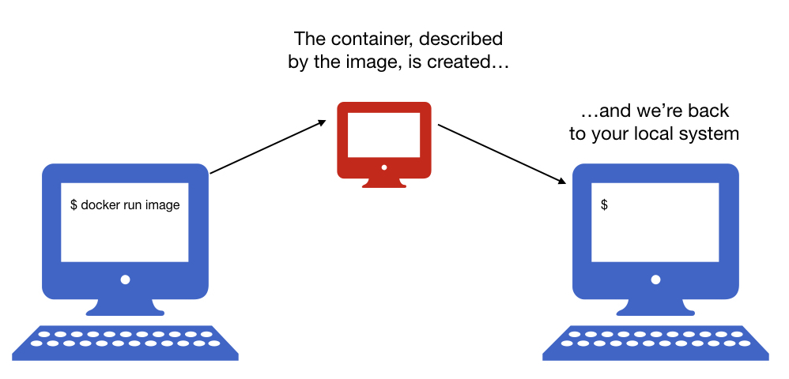
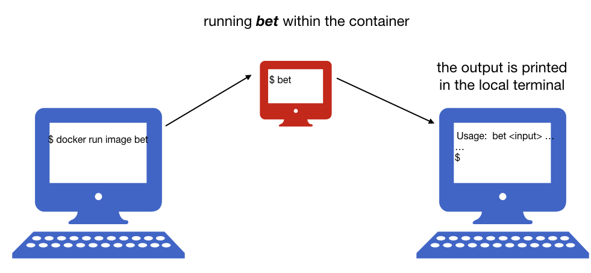
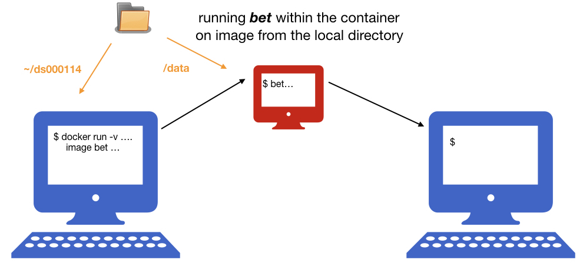
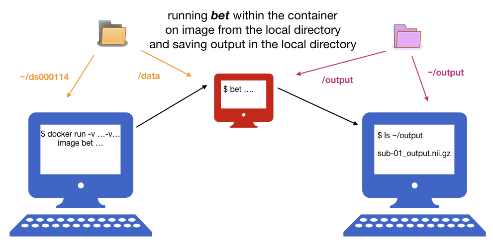

name: inverse
layout: true
class: center, middle, inverse
---
# Exercises

---
layout: false

- #### 1: Creating Docker images with FSL and Python
- #### 2: Running *bet* within the container

---

name: inverse
layout: true
class: center, middle, inverse
---
### 1: Creating an image with FSL
---
layout: false

- #### In order to create a docker image we need to write a Dockerfile, that contains all the commands a user could call on the command line to assemble an image. Dockerfile provide a “recipe” for an image.

  - a simple Dockerfile might look like this

  ```bash
  FROM ubuntu:latest
  RUN apt-get update -y && apt-get install -y git emacs
  ```

---
layout: false
  - a more complicated Dockerfile with FSL might look like this 

  ```bash
  FROM neurodebian:stretch-non-free
  ARG DEBIAN_FRONTEND="noninteractive"

  ENV LANG="en_US.UTF-8" \
      LC_ALL="en_US.UTF-8" \
      ND_ENTRYPOINT="/neurodocker/startup.sh"
  RUN export ND_ENTRYPOINT="/neurodocker/startup.sh" \
      && apt-get update -qq \
      && apt-get install -y -q --no-install-recommends \
             apt-utils bzip2 ca-certificates \
             curl locales unzip \
      && apt-get clean \
      && rm -rf /var/lib/apt/lists/* /tmp/* /var/tmp/* \
      && sed -i -e 's/# en_US.UTF-8 UTF-8/en_US.UTF-8 UTF-8/' /etc/locale.gen \
      && dpkg-reconfigure --frontend=noninteractive locales \
      && update-locale LANG="en_US.UTF-8" \
      && chmod 777 /opt && chmod a+s /opt \
      && mkdir -p /neurodocker \
      && if [ ! -f "$ND_ENTRYPOINT" ]; then \
           echo '#!/usr/bin/env bash' >> "$ND_ENTRYPOINT" \
      &&   echo 'set -e' >> "$ND_ENTRYPOINT" \
      &&   echo 'if [ -n "$1" ]; then "$@"; else /usr/bin/env bash; fi' >> "$ND_ENTRYPOINT"; \
      fi \
      && chmod -R 777 /neurodocker && chmod a+s /neurodocker
  ENTRYPOINT ["/neurodocker/startup.sh"]
  RUN apt-get update -qq \
      && apt-get install -y -q --no-install-recommends \
             fsl-5.0-core \
             fsl-mni152-templates \
      && apt-get clean \
      && rm -rf /var/lib/apt/lists/* /tmp/* /var/tmp/*
  RUN sed -i '$isource /etc/fsl/5.0/fsl.sh' $ND_ENTRYPOINT

  ```

---
layout: false

### [Neurodocker](https://github.com/kaczmarj/neurodocker)

&nbsp;
- generates custom  Dockerfiles and Singularity files for neuroimaging software and minifies existing Docker images

- simplifies writing a new Dockerfile and Singularity files

- incorporates the best practice for installing software

- supports popular neuroimaging software: AFNI, ANTs, Convert3D, dcm2niix, FreeSurfer, FSL, MINC, Miniconda (Python), MRtrix3, PETPVC, SPM, NeuroDebian

- uses ReproZip for minifying existing Docker images

&nbsp;

  - Creating a Dockerfile that includes FSL from Neurodebian:

  ```bash 
  docker run --rm kaczmarj/neurodocker:master generate docker \
  --base neurodebian:stretch-non-free \
  --pkg-manager apt \
  --install fsl-5.0-core fsl-mni152-templates \
  --add-to-entrypoint "source /etc/fsl/5.0/fsl.sh"

  ```
---
layout: false

### Building a Docker image

- creating a new empty directory

```bash
mkdir my_docker
cd my_docker
```

- creating a Dockerfile using Neurodocker:
```bash
docker run --rm kaczmarj/neurodocker:master generate docker \
--base neurodebian:stretch-non-free \
--pkg-manager apt \
--install fsl-5.0-core fsl-mni152-templates \
--add-to-entrypoint "source /etc/fsl/5.0/fsl.sh" > Dockerfile

```

- building a Docker image:

```bash
docker build -t my_fsl .

```

- checking available Docker images:

```bash
docker images
```

---
layout: false

### Building a Singularity image

- creating a Singularity file using Neurodocker:
```bash
docker run --rm kaczmarj/neurodocker:master generate singularity \
--base neurodebian:stretch-non-free \
--pkg-manager apt \
--install fsl-5.0-core fsl-mni152-templates \
--add-to-entrypoint "source /etc/fsl/5.0/fsl.sh" > Singularity_fsl

```

- building a Singularity image:

```bash
sudo singularity build my_fsl.simg Singularity_fsl

```

---
name: inverse
layout: true
class: center, middle, inverse
---
### Exercise 1: Create a Docker image with FSL and conda environment with python 3.7 and numpy library
---
layout: false

- Use [the Neurodocker examples page](https://github.com/kaczmarj/neurodocker/tree/master/examples) for help 
(search for `miniconda` software) and update the previous command

- Add the python part to the end of the Neurodocker command

--
#### Solution

- creating a Dockerfile_conda using Neurodocker:
```bash
docker run --rm kaczmarj/neurodocker:master generate docker \
--base neurodebian:stretch-non-free \
--pkg-manager apt \
--install fsl-5.0-core fsl-mni152-templates \
--add-to-entrypoint "source /etc/fsl/5.0/fsl.sh" \
--miniconda create_env=my_env \
            conda_install='python=3.7 numpy' \
            activate=true > Dockerfile_conda

```

- building a Docker image (note, that we have to specify our name of Dockerfile if we don't use the default name, i.e. "Dockerfile"):

```bash
docker build -t my_fsl_conda -f Dockerfile_conda .

```
You could notice that creating FSL layers is fast, since Docker already have this layers available in `my_fsl` image.
If you change the order of installing FSL and Python, Docker will have to start installing everything from the beginning.

- checking available Docker images:

```bash
docker images
```

---
name: inverse
layout: true
class: center, middle, inverse
---
## 2: Running *bet* within the container
---
layout: false

- running container
```bash
docker run my_fsl
```
--



---
layout: false

- running command within the container
```bash
docker run my_fsl bet
```
--




---
layout: false

- installing a datalad repository and downloading one T1w file 
(if you are using the ReproNim VM, you should use `section2` conda environment)
```bash
mkdir data
cd data
datalad install -r ///workshops/nih-2017/ds000114
datalad get ds000114/sub-01/ses-test/anat/sub-01_ses-test_T1w.nii.gz
cd ..
```

- mounting a local directory with data and running *bet* on the T1w file: 
```bash
docker run -v ~/data/ds000114:/data my_fsl bet \
/data/sub-01/ses-test/anat/sub-01_ses-test_T1w.nii.gz sub-01_output
```
--
- checking the output
```bash
ls -l
```
--




---
layout: false

- creating a new directory for output
```bash
mkdir output
```

- mounting two local directories, with data and output, and running *bet* on the T1w file:
```bash
docker run -v ~/data/ds000114:/data -v ~/output:/output my_fsl bet \
/data/sub-01/ses-test/anat/sub-01_ses-test_T1w.nii.gz /output/sub-01_output
```
--
- checking the output
```bash
ls -l output
```
--



---
name: inverse
layout: true
class: center, middle, inverse
---
### Exercise 2: Running bet analysis with Singularity

---
layout: false

- Create a Singularity image with FSL (use neurodocker)

- Repeat the bet analysis using the Singularity image 
(note, that the home directory is automatically mounted, `-B` can be used to add more mounting points) 

--
#### Solution

- creating a Singularity image:

```bash
mkdir ~/my_singularity
cd ~/my_singularity
docker run --rm kaczmarj/neurodocker:master generate singularity \
--base neurodebian:stretch-non-free \
--pkg-manager apt \
--install fsl-5.0-core fsl-mni152-templates \
--add-to-entrypoint "source /etc/fsl/5.0/fsl.sh" > Singularity_fsl

sudo singularity build my_fsl.simg Singularity_fsl

```

- running `bet` analysis

```bash
singularity run ~/my_singularity/fsl.simg bet \
~/data/ds000114/sub-01/ses-test/anat/sub-01_ses-test_T1w.nii.gz \
~/output/sub-01_output_sing
```

- checking the output

```bash
ls -l ~/output
```


---
layout: false

- running an interactive session:
```bash
docker run -it my_fsl
```
--


--
- running an interactive shell with Singularity:
```bash
singularity shell image
```
  - it doesn't run automatically the file specified in `%runscript` or `ENTRYPOINT`.

---
layout: false

- checking running containers
```bash
docker ps
```

- checking all containers
```bash
docker ps -a
```

- removing a container
```bash
docker rm <container id>
```

- removing all containers that stopped running 
```bash
docker rm $(docker ps -a -q)
```

- **use `--rm` option to remove the container after it exits**, e.g.: 
```
docker run --rm  fsl ls
```
--
&nbsp; 

- checking a list of running Singularity images
```bash
singularity instance.list
```
