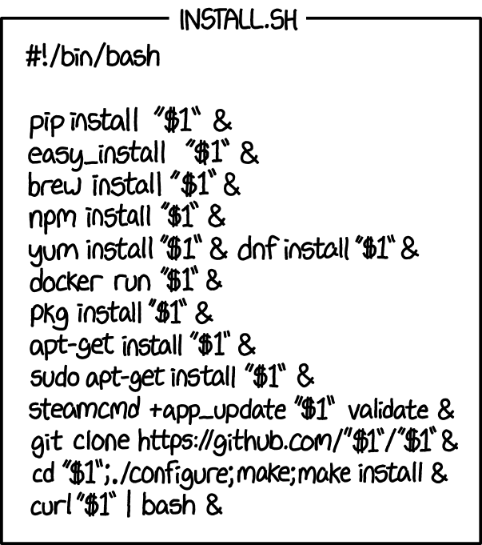
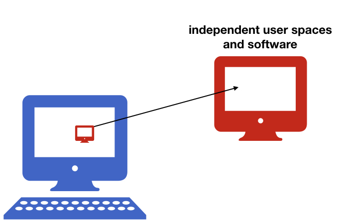
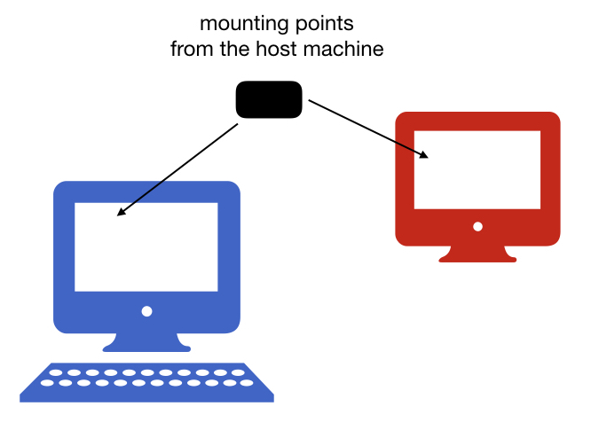
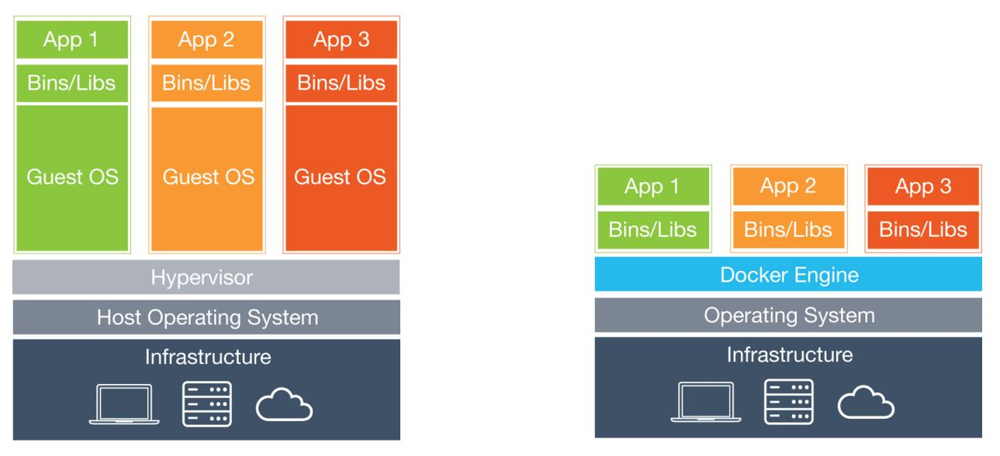

name: inverse
layout: true
class: center, middle, inverse
---
# Container-based environments

---
name: inverse
layout: true
class: center, middle, inverse

<!--
---
## Common scenarios in research

???
- Computational environments are difficult to reproduce.
  - You are running a neuroimaging study with remote collaborators. Collaborator asks you to share your environment with them. You tell them, "just install python 3 with these 4 libraries and ANTs version 2.3.0." This sounds simple. But I am on Linux, where ANTs builds just fine. My collaborator is on Windows, which ANTs doesn't support. What now?
  - Another example, you published a paper a few years ago, and a group wants to reproduce it. You can share your data, but how do you share the computational environment you used when writing the paper? It would be very difficult.
- Environments are mutable and change unexpectedly.
  - Updating one Python package, for example, might update other packages, without you realizing. This could have unexpected effects on the outputs of your analyses. In a multi-year study, this could be a very big problem.

-->
---

layout: false

### Common scenarios in research

- #### Computational environments are difficult to reproduce.
- #### Computational environments change (unknowingly) during the life of a study.

???
- Computational environments are difficult to reproduce.
  - You are running a neuroimaging study with remote collaborators. Collaborator asks you to share your environment with them. You tell them, "just install python 3 with these 4 libraries and ANTs version 2.3.0." This sounds simple. But I am on Linux, where ANTs builds just fine. My collaborator is on Windows, which ANTs doesn't support. What now?
  - Another example, you published a paper a few years ago, and a group wants to reproduce it. You can share your data, but how do you share the computational environment you used when writing the paper? It would be very difficult.
- Environments are mutable and change unexpectedly.
  - Updating one Python package, for example, might update other packages, without you realizing. This could have unexpected effects on the outputs of your analyses. In a multi-year study, this could be a very big problem.

---
name: inverse
layout: true
class: center, middle, inverse

---
## Containers solve all of these problems!

(and more)

---
name: inverse
layout: true
class: center, middle, inverse

---
## Introduction

---

layout: false

### What is a container?

#### A container is a "standardized unit of software" that can run anywhere (Docker.com).

### What do containers provide?

- #### Standard method of creating and sharing computational environments
- #### Isolation of computational environments
- #### Easy interoperability
  - Containers can be run on Linux, macOS, and Windows
- #### Immutability of environments
  - You cannot permanently alter a container unintentionally

---

### Why do we need containers?
#### Long term perspective

### Science Reproducibility

  - Each project in a lab depends on complex software environments
    - operating system
    - drivers
    - software dependencies: Python/MATLAB/R + libraries
&nbsp;

  - Containers:
    - allow to encapsulate your environment
    - you (and others!) can recreate the environment later in time

---
###  Why do we need containers?
####  Short term perspective

### Collaboration with your colleagues

- Sharing your code or using a repository might not be enough
&nbsp;

- Containers:
  - encapsulate your environment
  - you can easily share the environment

---
###  Why do we need containers?
####  Short term perspective

### Changing hardware

- The personal laptop might not be enough at some point
&nbsp;

- Containers:
  - encapsulate your environment
  - you can easily recreate the environment on a different machine

---

###Why do we need containers?
#### Short term perspective

### Freedom to experiment!
- Universal Install Script from xkcd: *The failures usually don’t hurt anything...*
 And usually all your old programs work...

---
###  Why do we need containers?
####  Short term perspective

### Using existing environments

- Installing all dependencies is not always easy.
&nbsp;

- Containers:
  - isolate and encapsulate the environments
  - there are many ready to use existing environments (check [Docker Hub](https://hub.docker.com/))

---

### What does it mean to work in a container

If you are running a container on your laptop
&nbsp;

- it uses the same hardware

- but user spaces and libraries are independent

--

---
### What does it mean to work in a container

If you are running a container on your laptop
&nbsp;

- it uses the same hardware

- but user spaces and libraries are independent

- you can create additional bindings between these two environments

---

name: inverse
layout: true
class: center, middle, inverse
---
## Tools
---
layout: false

### Virtual Machines and Containers

- Two main types:

  - Virtual Machines:

      - Virtualbox
      - VMware
      - AWS, Google Compute Engine, ...

  - Containers:

      - Docker
      - Singularity
&nbsp;

--

- Main idea -- isolate the computing environment

  - Allow regenerating computing environments
  - Allow sharing your computing environments

---
### Virtual Machines vs Containers

--

 **Virtual Machines**
  - **emulate whole computer system (software+hardware)**
  - use *hypervisor* to share and manage hardware of the host, and execute the guest operating system
  - guest machines are completely isolated and have dedicated resources
---
### Virtual Machines vs Containers

  

   **Docker containers**
  - **share the host system’s kernel with other containers**
  - each container gets its own isolated user space
  - only bins and libs are created from scratch
  - **containers are very lightweight and fast to start up**

---
### How  do we choose the technology

There is no one solution that always works, your choice should depend on:
- which hardware is available to you (also do you require GPU)
- where is your data stored
- Docker might me the most portable technology right now, but...
  - if you use HPC centers you will have to use Singularity instead.

---
###Docker and Singularity 
- **Docker:**
  - leading software container platform
  - an open-source project
  - **it runs on Linux, macOS, and Windows Pro** (you don't have to install VM!)
--

  - **can escalate privileges - not supported by HPC centers admins**

--

- **Singularity:**
  - a container solution created for scientific application
  - **supports existing and traditional HPC resources**
  - a user inside a Singularity container is the same user as outside the container
(so you can be a root only if you were root on the host system)
  - VM needed on macOS and Windows
  - a Singularity image can be created from a Docker image
